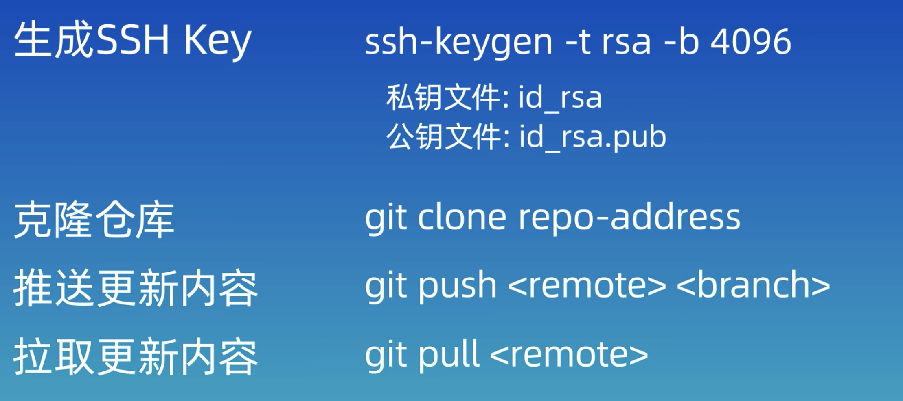

（来源：https://www.bilibili.com/video/BV1HM411377j?p=2&spm_id_from=pageDriver&vd_source=b9eb6dd7cd13f2b13f30af094ee56ec2）

## P2_配置

## P3_新建仓库
```
git init [文件夹名称]
git clone

ls -a
```

## P4_工作区域

### 工作区域
工作区，<br>(git所在目录)

`git add` 添加到

Staging 暂存，<br>(.git/index)

`git commit` 添加到

本地仓库，<br>(git/objects)

### 工作状态


## P5_添加和提交文件
### 5.1 创建文件

```
echo "content" > fileName.extension
```

### 5.2 添加至暂存区
```
git add 

//通配符匹配规则
git add *.txt 
git add .

git rm --cached <file>...
```

notes：
通配符匹配规则，p8会详细说明


### 5.3 从暂存区至本地repo  
(但这里只是暂存区，如果在`git add` 之后的文件修改、添加、删除是没有track的，commit不会生效)
```
git commit -m
```

没有 `-m` 就会进入vim编辑器，ESC退出编辑模式，`:wq`是保存并退出

### 5.4 查看commit记录

```
git log 
git log --oneline
```

Notes: 换行操作

    在 Markdown 中，要创建一个换行（而不是新的段落），可以使用两个空格或者使用 \<br> 标签。

## P6_git reset
### 三种 

```
git rest --hard ^HEAD
```
误操作恢复
```
//查询历史操作记录，选择要恢复的版本
git reflog 
```

## P6_git diff
### sanzhong 

```
//默认是比较工作区和暂存区（git add 前后）
git diff

//比较工作区和本地repo之间
git diff HEAD

//比较暂存区和本地repo之间
git diff --cached

//比较版本之间
git diff id1 id2

//比较HEAD 和上一个版本之间
git diff HEAD~/^ + num HEAD

//比较HEAD 和上一个版本之间
git diff HEAD~/^ + num HEAD + fileName
```

## P8_git rm
### 删除的两种方法

#### 1
```
rm fileName //先删除工作区的文件
git add . //提交到暂存区
git commit -m
```

#### 2
```
git rm //同时删除工作区和暂存区
git rm --cached <file_name> //只删除staging area里面的文件，保留工作区的
git commit -m
```


## P8_git_ignore
### 8.1 规则
忽略的文件夹是以 `/` 结尾  
如果一个文件已经在本地repo中，想要删除，并更新本地repo，做法如下：
```
// 现在staging中删除这个文件
git rm --cached <file_name>

//然后commit 更新本地repo 
git commit -m "Removed <file_name>" 

//可以查看状态, s means short
git status -s 
```

### 8.2 通配符匹配规则

空行或者以＃开头的行会被Git忽略。一般空行用于可读性的分隔，＃一般用作注释 <br>
使用标准的Blob模式匹配，例如：<br>
星号 *通配任意个字符<br>
问号？匹配单个字符<br>
中括号[]表示匹配列表中的单个字符，比如：[abc] 表示a/b/c<br>
两个星号 ** 表示匹配任意的中间目录<br>
中括号可以使用短中线连接，比如：<br>
[0-9]表示任意一位数字，[a-z]表示任意一位小写字母<br>
感叹号！表示取反<br>

`/`表示根目录<br>
`build/`忽略所有文件夹下的build文件夹

github上有常用忽略模版

## P10_Gitub注册账号
### 

## P11_SSH和配置仓库
### 
到根目录
cd 

到.ssh文件

没有的话可以创建
ssh-keygen -t rsa -b  4096

会提示输入ssh名称、密码（可以为空）

ls -ltr可以查看文件ssh文件

.pub为后缀的是keygen文件
vi Name.pub //打开

然后添加到github上

这里回到terminal 配置一下这段代码

```
tail -5 config //意思是在congif文件后面加5句话
# github
Host github.com
HostName github.com
PreferredAuthentications publickey
IdentityFile ~/.ssh/<SSHfileName>
```

意思是当访问github时，指定使用相应文件名称的keygen


## P12_关联本地仓库和远程仓库
本质上来说，local repo 和 remote repo 是两个独立的repo，需要及时pull and push
(注意clone时，已经把remote repo的名称设置为origin了)
<br>pull 是fetch and merge 


### 1. 先有远程repo
1. 先把远程仓库clone到目标文件夹中

2. 本地工作区coding完成后，需要add，commit，目的是在本地repo中存好

3. push到远程repo
    ```
    git push -u origin main
    ```
### 2. 把本地的push到remote
1. 创建remote repo
2. 

    ```
    //把本地和remote 关联起来
    git remote add <shortName> <url> 

    //查看本地和远程repo情况，一个本地repo可以remote add 多个远程repo 
    git remote -v 

    //指定分支名称为main
    git branch -M main 
    git push -u origin(remote repoName) main(local):main(remote)
    ```


## P13_Gitee, Gitlab
### 
一个本地repo可以remote add 多个远程repo
```
git push -u origin(remote repoName) main(local):main(remote)
```

## P15_Vscode
一些vscode说明


## P16_分支
### 

比如，在main主分支上有3个txt文件。
这时新建一个dev分支，则会在已有的主分支和其文件基础上工作。
但在没有merge的情况下返回main分支时，main不会有在dev上创建的工作文件
如果，这时返回main新建文件和工作，就会出现下图的分支情况


当想要将dev分支合并到main时，先切换到main分支上，然后执行` merge` 命令，这时会自动执行一次提交命令，需要输入提交信息，可以直接`:wq`用默认信息保存。流程如下图


merge后，分支不会自动删除，可以手动`-d`删除。
没有merge的分支不可以`-d`删除，但是可以`-D`来删除

```
//创建
git branch <branchName>

//查看分支列表
git branch <branchName>

//切换分支, 但这个命令同样也可以恢复文件，如果出现分支和文件重名，则会默认执行切换分支
git checkout

//这个只会更换分支
git switch

//合并分支到当前分支
git merge <branch to be merged>

//查看分支合并日志
git log --graph --online --decorate --all

//删除分支
git branch -d <branchName>
```

## P17_合并解决冲突
### 
一般在不同的分支上对同一个文件的同一行做出了不同的修改，在合并时会有冲突的情况。

当执行`git merge`的时候会有冲突的提示，并需要手动解决

可以用`git diff`， 来查看冲突的具体内容， 然后去具体文件中修改。


```
git merge --abort

git commit -a -m 'text'
git commit -am 'text'
```

## P18_rebase合并方法 

可以在任意分支上执行`git rebase <tagrgetBranchName>` ，但目标<branchName>不一样所产生的效果也不太一样。如下图


原理是：每一个分支都有自己的HEAD指针指向该分支最新的commit节点，在执行`git rebase <tagrgetBranchName>`之后，他会将两个分支的共同祖先（提交记录）后产生的提交记录所涉及的文件添加到目标分支最新的记录后面

（注意，git rebase并没有将feature branch删除。解释如下：

it rewrites the commit history by creating new commits for each original commit in the feature branch and places them on top of the main branch. This can make the commit history appear linear, but it does not remove the original feature branch.）

 
```
//给太长的命令设置别名
alias <Name>='git log --graph --online --decorate --all'

//回退命令
git reset (--hard) <hashcode>

//回退命令被删除的分支
git checkout -b <branchName> <hashcode>
```

### 优缺点
线型直观，但改变branch out的节点，避免共享使用

## P19_工作流模型
### GitFlow 
### GithubFlow

