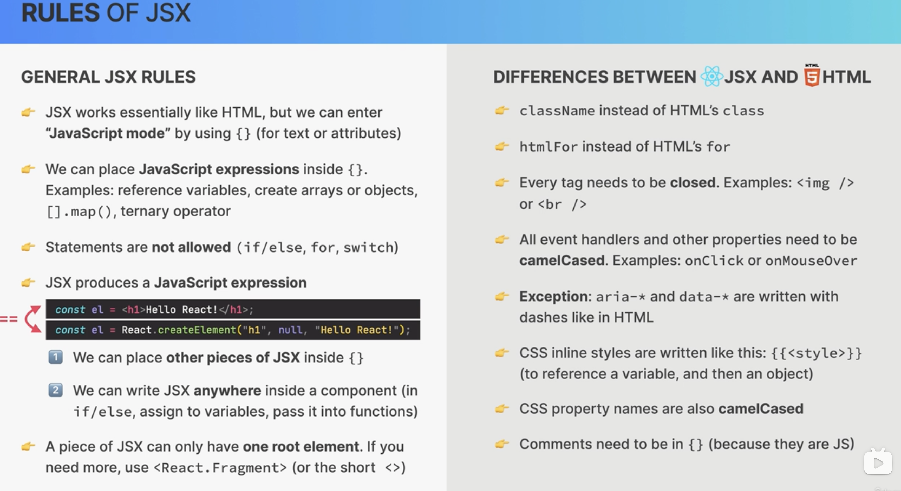
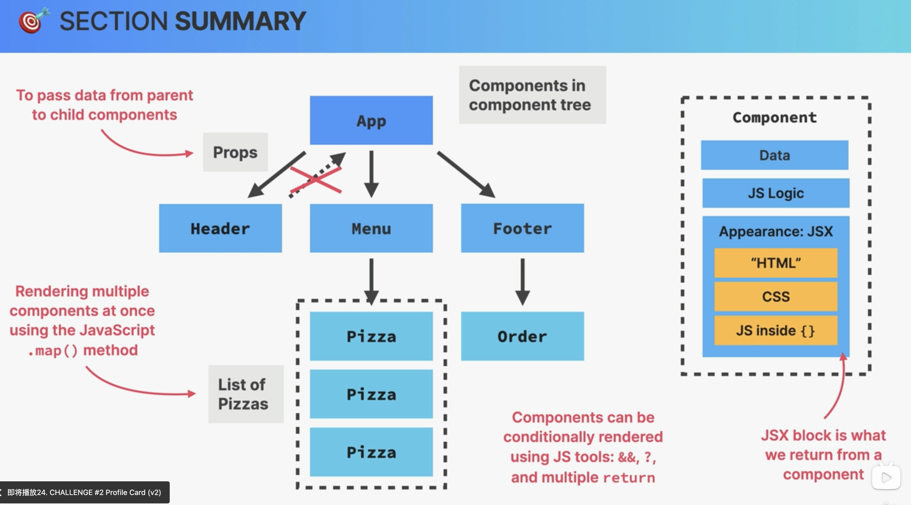

## s1-p35

JSX, declarative

JS, Imperative, need to touch DOM

React does not touch DOM

## s1-p39

CSS in React

inline css in JSX
`{{}}` , the outer means it's JS, inner means is an object

2.  import css

3.css component, later

## s1-p40 props, property

在 component /function 定义的时候，传入的形参是 props, 而且是从 parents 传入 children compos

```
function Pizza(props){}
```

callback 时，在标签里添加的其实就是 实际的 propos 属性）
如果 value ==不是 string 的话==，需要加上{}
（就是 callbackfunction 时，实例传入的参数，这么理解。compo fn 是函数，parents compo 的是实例）

```
<Pizza
name="Pizza Spinaci"
ingredient="Tomato, mozarella, spinach, and ricotta cheese"
photoName="pizzas/spinaci. jpg"
price={10}
/>
```

## s1-p40-41 data type

props，parent，immutable，read-only
state，internal

one-way data flow
from parents to children only

but there is a way to pass to parent

## s1-43

for, swith, if/else
不可以在 JSX 中使用



GENERAL JSX RULES
• JSX works essentially like HTML, but we can enter
"JavaScript mode" by using `{}` (for text or attributes)
• We can place JavaScript expressions inside `{}`.
Examples: reference variables, create arras or objects, `[]. map ()`, ternary operator
• Statements are not allowed (if/else, for, switch)
JSX produces a JavaScript expression

```
const el = <h1>Hello React!</h1>;
const el = React. createElement ("h1", null, "Hello React!");
```

We can place other pieces of JSX inside {}
2 We can write JSX anywhere inside a component (in
if /else, assign to variables, pass it into functions)
~ A piece of JSX can only have one root element. If you need more, use` <React. Fragment>` (or the short `<>`)

DIFFERENCES BETWEEN & JSX AND @HTML

- className instead of HTML's class
  ~- htmlFor instead of HTML's for
  ~ Every tag needs to be closed. Examples: 
- All event handlers and other properties need to be
  camelCased. Examples: onClick or onMouseOver
  •- Exception: aria-_ and data-_ are written with
  dashes like in HTML
- CSS inline styles are written like this: ``
  (to reference a variable, and then an object)
  •- CSS property names are also camelCased
  •- Comments need to be in {} (because they are JS)

## s1-49 deconsructing props

## s1-50 fragments

两种形式

```
<></>
<React.Fragment key={}></React.Fragment>
```

## s1-50 JS template literal

```
className={`pizza ${pizzaObj.soldOut ? "sold-out" : ""}`}

```


