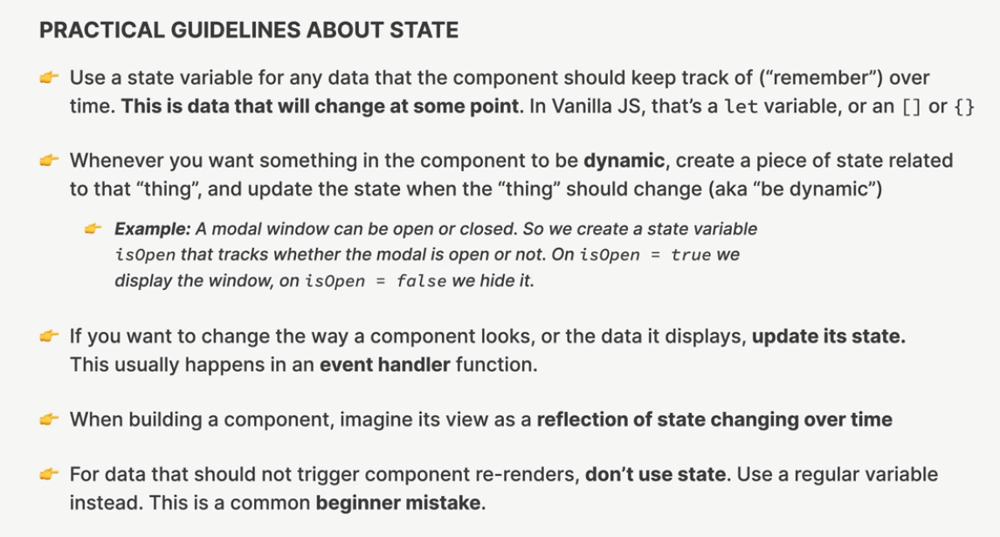

## s2-p3 events

不用加()
`onClick = {fnName}`

## s2-p4 states

语法：\*\*\*\*
useState(defaultData)

使用：
[var, fnName] =useState(defaultData)

位置：
只能在 jsx，component 最外层

## s2-p5 states

==用 useState 提供的 fn 来更新里面的数据==

普通 js 方法更新只作用于 object 的 value（但是不建议）
更改 array 的 desonstructing 变量无效

## s2-p10 states

==用 callback fn 来更新 state 数据==

```
[var, fnName] =useState(defaultData)
fnName((newVarName) => newVarName + 1)
```

## s2-p11 states



## s2-p17 states

`Array.from({length:20}, (_,i)=>{i+1})`

第一个参数`{length:20}`指定了第二个函数`(_,i)=>{i+1})`运行的次数。
这个函数的第二个参数 i 是当前元素的索引，第一个参数 \_ 为 element，但我们没有使用

在`form`标签上加`onSubmit`和在`button`上加`onclick`的区别

form 上的可以联动<form>里面的<input>，按下 enter 也会提交

`e.preventDefault()`

input 的 event， `onChange`

## s2-24 如何传递 state

scope: local and global

### 1. s2-25-26 inverse data flow

手动把需要传递给不同 children components 的 state 放入 parents scope，这样可以作为 props 传入多个 children，同时可以通过 state 的 fn，来建立新的 state 数据（但注意是在同一个 parent scope 里面申明一个新的 function，在 function 里用 spread 方法`setItem((items) => [...items, newItem])`）

## 关于 props 传入机制的理解：

当调用 component 的时候，在 tag 里面写的属性与值的 kvpair 会被添加到对象 props 上

```
<Form onAddItem={handleAddItem} />
<PackingList itemsInput={items} />
```

上面的代码就是在`fn Form`和`fn PackingList`的 props 上面添属性

然后在定义 component 的时候，定义从 propos 这个 object 上面解构出对应属性（换句话说，就是在 component scope 内创建了数据（变量））
(解构的时候，一定是解构定义的==属性名称==)

```
function Form({ onAddItem }) {}
function PackingList({ itemsInput }) {}
```

### 2. s2-29 Derived State

## s2-31-sorting-Items

react 里面的数据是 immutable 的，所以当 react 中的 array 需要增删改查的时候，会用到`.map()`, `.reduce()`, `.filter()`,`.slice()`，因为他们都会返回一个新的 array

同理，对于对象 objectName 数据来说，需要先通过 spread 来拷贝一个新的 object，然后修改其属性 property
`{...objectName, object.property:key}`

<button
className="actions"
=> {
clearUp(!);
console.logUp);
}}

> Clear Up
> </button>

## s2-33-moving-components into seperated files

Ctrl + Shift + [：折叠当前光标所在代码块

Ctrl + Shift + R：refractor

## s2-35-36-the-children-props


## s2-51-53


## s2-54 props drilling

## s2-55-57 component composition

就是在调用 component 的时候，作为 children 传入的
如果两个 components 在同一个祖先级 components P 的调用中，且 B 是 A 的下层（P-A-B），同时 B 需要 P 的 scope 的 data，则可以把 b 作为 children 传入 A 中，直接调用 p 的数据，避免 props drilling


## s2-58 passing elements as props

也可以把 components 用传 props 的方式传入

（

1. 最开始，是在 component==定义==的时候一层层传递，然后只要调用最外面的那个，就可以展示全部
2. 然后学了作为 children 传入：在==调用==的时候，同时传入子级（更方便子级调用祖父级 scope 里的 data，同时整体结构更清晰，更接近浏览器 inspect 里面的结构）
3. 另外， 可以作为 props 把子级 components 传入
   ）
