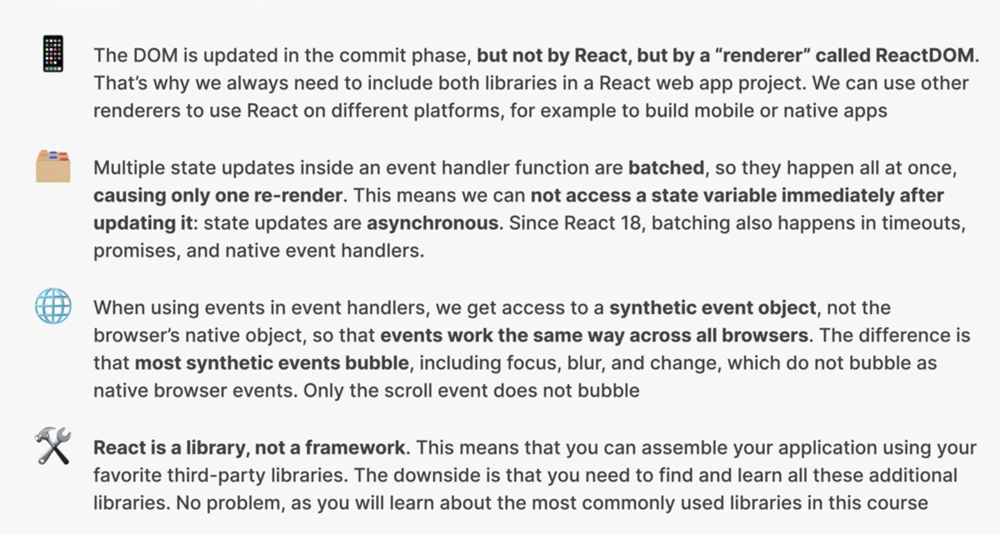

## s3-p1-p7 how react works

### components and instances


### Rendering Phases


### Triggers(Rendering Situations)


### Render Phase


### Virtual and Firber Tree


### Commit Phase


### Recap


## s3-p13 Pureness

主要强调，pure 的组件不可以直接更改 outter scope 变量的 value，因为都是 immutable 的，所以要用`.map()`等的方法来 return 一个新的列表
另外，可以通过 useState 来改变变量


## s3-p14 Batching and Async


## s3-p15 State Update Batching

因为 setState 是 async 的，如果有多个 setState 对同一个 state 进行操作，就会出现延迟的现象，因为 trigger 了 update，但是第一个 update 了之后，state 所在的 component 的还不会进行 diffing 个 update fiber tree，所以后面的 setState 不会被更新。但是用 callback fn，并把 state 作为参数传入，可以解决这个问题。


## s3-p16 event propagation and delegation

有点模糊，但不是很影响写代码


## s3-p17 frames and library

还有以 react 为基础的 frame 工具，next.js 等等，是


## s3-p19 summary




## s3-p21

不能在 component 里面直接 fetch api（设置 setState） 然后 setState 给组件，会出现无限 loop 的问题。
（因为 component 渲染的时候会更新 state，更新了 state 又会重新渲染 component，变成无限循环）


## s3-p22 useEffect

## s3-p23-24 useEffect


useEffect()里面的 fetch 处理写法有两种：
async 和 promise（原理和 JS 差不多，但是句法有点要求）


console.log 两次是因为 strict model

## s3-p26 handling errors

`catch(err)`句法
`finally{}`句法

## s3-p27 useEffect dependency

dependencies 传入的参数一般是 states 或 props
当 dependencies 改变时，会调用 useEffect，获取外部数据

注：effect 是在 broswer paint 之后才调用的

## s3-p28 Synchronizing Queries

useEffect 之间 和其他 js 指令的顺序

```
useEffect(fn, [x,y,z])
useEffect(fn, [])
useEffect(fn)
```


## s3-p28 selecting a movie

## s3-p34 cleanUp

根据 component 的 life cycle，cleanUp 主要作用是 component destory 之前要执行的命令
（所以 useEffect 可以控制组件 initial、state，props 改变、每次变化以及消失之前的各种阶段所执行的命令）

语法：在 useEffect 的 fn 里，最后加上一个 return fn

```
useEffect(
    fn(){
        return fn(){} //这个是cleanup
    }, [])
```

## s3-p35 cleanUp 中添加中止器，controller

目的：就是终止即将被 destory 的 旧的 component 里的 api request，避免 race conditions
申明一个 new AbortController

在 request 的函数里面连接 controller
`{signal:controller.signal}`

在 cleanUp 的 return 中调用（当这个 component 被 destroy 之前会执行这个 controller）

```
return function(){
    controller.abort()
}
```

另外，abort 本身是一种 error，但这里不需要被 catch，所以在 catch 里要把它 rule out

## s3-p36 添加 global event listener

```
useEffect (
    function () {
        document. addEventListener ("keydown", function (e) {
            if (e.code === "Escape") {
                onCloseMovie();
                console. log ("CLOSING");
            }
        });

    },
    [onCloseMovie])
```

如果不 clean up，那么每次有新的 component 被渲染的时候，就会有一个新的 event listening，造成 memory problem

```
useEffect (

    function () {

        function callback (e) {
            if (e.code === "Escape") {
                onCloseMovie();
                console. log ("CLOSING");
            }
        }

        document. addEventListener ("keydown", callback);

        return function(){
            document.removeEventListerner('keydown', callback)
        }

    },
    [onCloseMovie])
```

## s3-p39-p40 Rules on Hooks(chained list)

hook 的种类，除了 useState，useEffetc 还有很多

因为 hook 的 call order 是 chained data，（hooks 是以链表的形式存在于 fiber tree 中的每一个 fiber）。
所以 hooks 必须存在于 top level，不可以用在 condition 中，一旦 condition 为 false，hooks 就会 lost track
而 hooks 被设计使用 chained list 的原因是，react 会按顺序默认记录 hooks 的 value（就是浏览器里面 components 里面的 values），减少程序员的工作量

所以一旦在原来的 hook order 被改变，比如有 return 或者 if condition，就会出现问题

## s3-p41 async and stale of useState

因为 useState 是异步 async，所以如果在 setState()中，不用箭头函数 callback 并传入 state，那么，js 就会用 stale data

```
假设(imdbRating = 8 , userRating =10)

setAvgRating (Number (imdbRating)) ;
setAvgRating((AvgRating + userRating) / 2) ;

// output: 5
// 这里必须是AvgRating（useState申明的变量名称，不是传参，不可以随意定）

```

```
假设(imdbRating = 8 , userRating =10)

setAvgRating (Number (imdbRating)) ;
setAvgRating((AvgRating) => (AvgRating + userRating) / 2) ;

// output: 9
//这里的AvgRating是传参，可以是任意名字，只是前后要一致
```

（因为下面要介绍怎么在 local storage 储存，需要避免 stale data，所以这里复习了一遍）

## s3-p42 initializing state with a callback

persist local storage
把 watched list 保留下来，每次刷新不清空

思路：
每次 watched list 更新的时候，都会存入 local storage
每次打开页面的时候会把 local storage 给 watched list
(useState()里面可以写不传参数的 function，但一定要有一个 return value，这种方法只会作用 initial render，后面更新不会有作用)

```
//这时在event handle里面
LocalStorage.setItem("<name(watched)>", JSON.stringify([...<stateName(watched)>, <newItemName(movie)>]));

//也可以用useEffect
//这里就可以直接使用watched作为参数传入stringfy，因为useEffect只有在watched更新后才会被调用
//另外，也不用再写删除，因为当删除watched列表里面的元素时，也会调用这个useEffect，并更新local storage
useEffect(
    function () {
      localStorage.setItem("watched", JSON.stringify(watched));
    },
    [watched]
  );
```

.png>)

## s3-p43 summary on useState


## s3-p45 Introduction on Refs


## s3-p46 Refs to select DOM elements

```
//申明
const inputEl = useRef(null);

//在jsx的element tag 连接，并选择，这时inputEl.current 就是这个element
ref={inputEl}

然后可以对这个dom操作
```

## s3-p47 Refs to persist data between render

useRefs 的特点：在组件更新渲染之后还保留 value，但不会因为更新而 trigger 渲染

useState：保留 value，且引发渲染

普通的 variable：不保留 value，也不引发渲染

## s3-p48 custom hooks

### 如何决定是否使用：

是否在不同的项目中重复使用一段比较长的、包含一个或多个 hooks 的代码块
（就是一个自定义 function）

特点：

- 接受和返回 any relevant data
  （component 只能接收 props，返回 jsx）
- 需要使用一个或多个 hooks
- 用 use 开头命名，react 才可以识别

如何决定是否使用：

是否在不同的项目中重复使用一段比较长的、包含一个或多个 hooks 的代码块

## s3-p52 useGeolocation

定义一个 hook，然后 return 需要的变量和获取 geolocation 信息的 fn 给 App component
在 App component 点击按钮后，要更新点击次数，然后调用 fn 来更新和得到更新的信息

## s3-p54-55 first class component

在 react16.8(2019) 之前，没有 hooks，用 ==class==

基本语法
==注意在调用 function，state 时要写 this==

```
//申明class
class Counter<NAME> extends React.Component {

//基本语法
  constructor(props) {
    super(props);

    //申明state
    this.state = { count: 5 };

    //eventhandle 在 jsx 中的 elements 调用时，都会丢失 this 的指向元素,所以这里要在申明function之后手动bind一下，再传入elements
    this.handleDecrement = this.handleDecrement.bind(this);
    this.handleIncrement = this.handleIncrement.bind(this);
  }

handleDecrement() {
    // 调用这个class的setState方法，把this.state作为参数传入，然后修改count的数值
    this.setState((curState) => {
      return {
        count: curState.count - 1,
      };
    });
  }

  handleIncrement() {
    this.setState((curState) => {
      return {
        count: curState.count + 1,
      };
    });
  }

  //这个jsx差不多，在return外面多了一个render(){}
  render() {
    //这个里面可以写简单的render logic

    //是一个构造函数，这里date是一个实例化对象
    const date = new Date("june 21 2027");
    // 调用date函数的方法
    date.setDate(date.getDate() + this.state.count);

    return (
       <div>
        <button onClick={this.handleDecrement}>-</button>
        <span>
          {date.toDateString()}[{this.state.count}]
        </span>
        <button onClick={this.handleIncrement}>+</button>
      </div>
    );
  }
}
export default Counter;
```

## s3-p56 class component vs function component


## s3-p59 Displaying the Weather

如何在 class component 之间传递 props
如何解构 props
把 state 和 props 渲染在浏览器中

## s3-p60-removing-boilerplate-code

boilerplate

```
constructor(props) {
    super(props);
}
```

- 可以直接在 class component 里面 top level 申明 state（申明的时候没有 this 前缀，但调用的时候还是要写），不用写在 boilerplate 里面

- 申明函数时，用箭头函数可以省掉`.bind()`这个步骤

## s3-p61-child-to-parent-communication

如果需要在 child 组件里更改 parent 组件的 state 的话，需要在 parent 组件中申明一个调用 setState 的函数，并传递给 child，因为 child 不可以直接更改 parent 的 state

案例中，handleChangeLocation 就是这个愿意

## s3-p62-lifecycle-method

介绍了三种 class component lifecycle methods
并和 useEffect 进行了比较

```
  // 等同于useEffect[]，innitial render时
  componentDidMount() {
    this.setState({ location: localStorage.getItem("location") || "" });
    this.fetchWeather();
  }

  // 等同于useEffect[props,states]（initial奏效）,但这个在initial render时不奏效
  componentDidUpdate(pros, prevState) {
    if (this.state.location !== prevState.location) {
      this.fetchWeather();
    }
  }

  //等同于useEffect里面的return，组件消失时
  componentWillUnmount() {
    console.log("weathe will unmount");
  }

```
