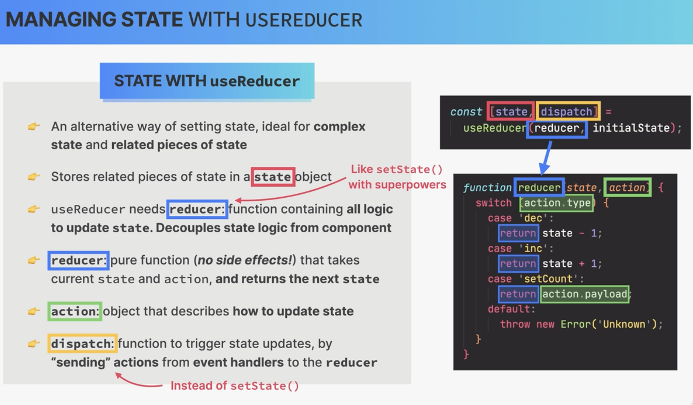
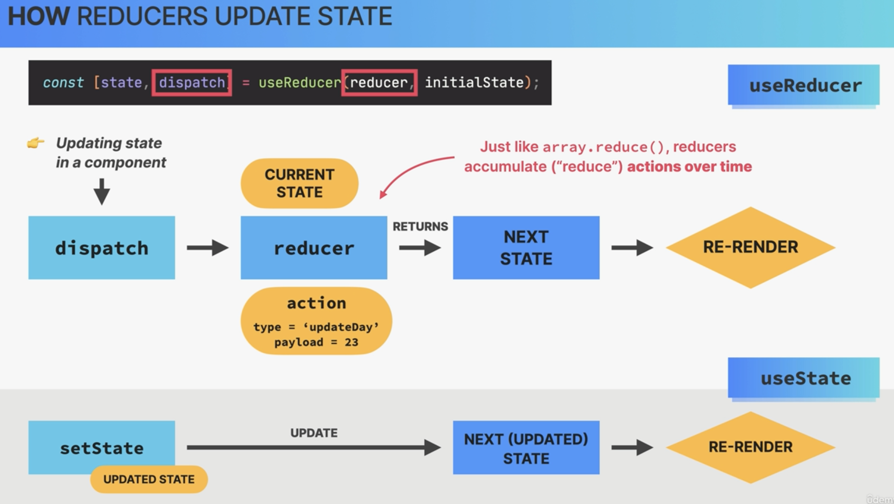
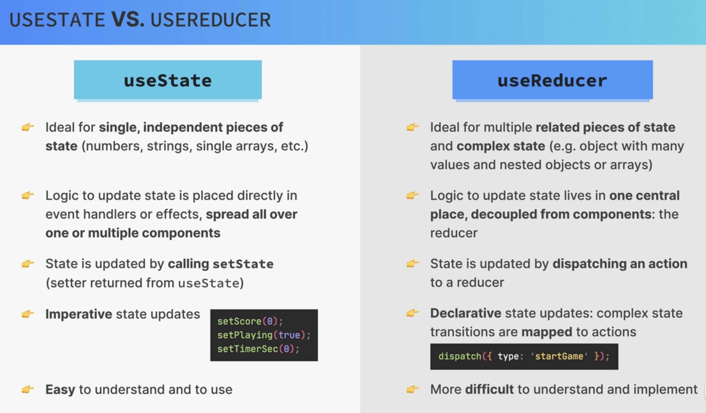

## The Advanced useReduced Hook

### s4-p1-p2-useReducer

dispatch()是 useReducer 自带的方法，用来设置改变的 state，他一般接受对象作为参数，对象中包括 type 和 payload

```
function fn (state, action){}

const [<stateName>, dispatch] =useReducer(fn, <initialState>)


//在申明的函数中调用dispatch
dispatch({type:<typeValue>, payload:<value>})

```




### s4-p3-p5-useReducer

把原来不同的 useState 中的 setState 整合到一个 reducer 中
另外，reducer 可以同时修改两个 state

注：state 的 immutable 特点，所以要`...state`

```
switch (expression) {
  case value1:
    // 代码块1
    break;
  case value2:
    // 代码块2
    break;
  // 更多 case 分支...
  default:
    // 默认代码块，当表达式的值与所有 case 分支都不匹配时执行
}

```

### s4-p6-Loading-Questions-from-a-Fake-API

fake API 设置

```
npm i json-server

//package.jso里面设置快捷指令
//它启动了一个 JSON Server 实例，监视名为 data/questions.json 的文件，并在本地的 9000 端口上提供 API 服务。
  "scripts": {
    "server": "json-server --watch data/questions.json --port 9000"
  }
```

fetch 数据之后，将 promise 的返回值作为参数传入 dispatch，并通过 reducer 更新 state

### s4-p7-p11 Handling-Loading,-Error,-and-Ready-Status

主要是创建静态页面框架，利用 reducer 返回的不同 value，来决定显示什么 UI

### s4-12 Displaying-Progress

html 元素`progress`

#### 注意 value

- 如果回答了问题（answer 为 true）但还没有 next，value = index+1

- 没有回答问题（answer 为 false），value 为 index

```
<progress max={numQuestions} value={index + Number(answer !== null)} />
```

### s4-12-Restarting-a-Quiz

不能清空 questions，要把旧的传进来，不然会出错

```
    return { ...initialState, questions: state.questions, status: "ready" };
```

### s4-12-Setting-Up-a-Timer-With-useEffect

当计数器===0，更改 status

```
case "tick":
      return {
        ...state,
        secondsRemaining: state.secondsRemaining - 1,
        status: state.secondsRemaining === 0 ? "finished" : state.status,
      };
```

另外，当计数器 ui 消失，要清除

```
function Timer({ dispatch, secondsRemaining }) {
  useEffect(
    function () {
      const timer = setInterval(function () {
        dispatch({ type: "tick" });
      }, 1000);
      return () => clearInterval(timer);
    },
    [dispatch]
  );
  return <div className="timer">{secondsRemaining}</div>;
}

```

### s4-16-Section-Summary-useState-vs-useReducer




## React Router: Building Single-Page Applications (SPA)

前面主要介绍了 css module 和 router 两个概念

### Creating-Our-First-App-With-Vite:-"WorldWise"

现在不需要了
vite 创建的项目，都需要安装 eslint 及插件

```
npm i eslint vite-plugin-eslint eslint-config-react-app --save-dev
```

### s4-p20-Routing-and-Single-Page-Applications-(SPAs)

### s4-p21-Implementing-Main-Pages-and-Routes

安装
`npm i react-router-dom@6`

使用 router 有关的 components

```
<BrowserRouter>
<Routes>
<Route>
```

### s4-p22-Linking-Between-Routes-With-<Link />-and <NavLink />

### s4-p23-Styling-Options-For-React-Applications

different options for CSS in React

### s4-p24-Using-CSS-Modules

CSS Modules 里面写申明 classname 后，
在导入对应的 component 里面时，会在 classname 后面自动生成一串字符串，所以不同的 CSS Modules 里就算有相同的 className 也不会冲突

global css class 方法一：
一般的 global css class 申明还是旧的方法在 index.css 里面

global css class 方法二：
CSS Modules 里也可以申明，`:global(.className)`，就可以避免自动生成的字符串。
主要应用在一些外部外部生成的 className 上

```
因为这个active是<NavLink>自动生成的，所以用global
.nav :global(.active) {
  background-color: green;
}
```

### s4-p27-Nested-Routes-and-Index-Route

是从 App --》AppLayout --》 SideBar,
在 SideBar 里面展示

```
//类似于children props
//把它当作components，在需要的component里直接调用
<Outlet />
```

### s4-p28-Implementing-the-Cities-List

### s4-p29-Implementing-the-Countries-List

如何创建 fake api，fetch api 里的数据，传入对应的 route 的 component 里面，然后在 component 里面渲染在 ui 中

### s4-p30-Storing-State-in-the-URL

### s4-p31-Dynamic-Routes-With-URL-Parameters

### s4-p32-Reading-and-Setting-a-Query-String

如何将信息储存在 url 中

```
<Link
        className={styles.cityItem}
        to={`${id}?lat=${position.lat}&lng=${position.lng}`}
>
```

如何获得 Params 和 query string

```
//这个对应App里面router中设置的path="cities/:id"
const { id } = useParams();

//这个是Params?之后的queryString搜索,是一个obj，里面是kv对应的
const [searchParams, setSearchParams] = useSearchParams();
const lat = searchParams.get("lat");
const lng = searchParams.get("lng");
```

### s4-p33-Programmatic-Navigation-with-useNavigate

### s4-p34-Programmatic-Navigation-with-<Navigate />

实现页面自动跳转`<Navigate />`

```
<Route index element={<Navigate replace to="cities" />} />
```

操作跳转

```
const navigate = useNavigate();

<div
    onClick={() => {
      navigate("<Path>");
    }}
>
```
