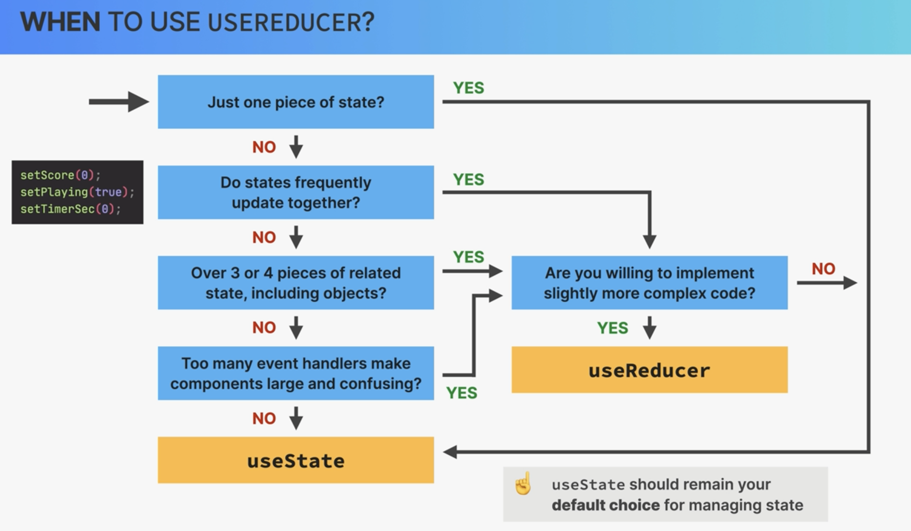

## The Advanced useReduced Hook

### s4-p1-p2-useReducer

dispatch()是 useReducer 自带的方法，用来设置改变的 state，他一般接受对象作为参数，对象中包括 type 和 payload

```
function fn (state, action){}

const [<stateName>, dispatch] =useReducer(fn, <initialState>)


//在申明的函数中调用dispatch
dispatch({type:<typeValue>, payload:<value>})

```


### s4-p3-p5-useReducer

把原来不同的 useState 中的 setState 整合到一个 reducer 中
另外，reducer 可以同时修改两个 state

注：state 的 immutable 特点，所以要`...state`

```
switch (expression) {
  case value1:
    // 代码块1
    break;
  case value2:
    // 代码块2
    break;
  // 更多 case 分支...
  default:
    // 默认代码块，当表达式的值与所有 case 分支都不匹配时执行
}

```

### s4-p6-Loading-Questions-from-a-Fake-API

fake API 设置

```
npm i json-server

//package.jso里面设置快捷指令
//它启动了一个 JSON Server 实例，监视名为 data/questions.json 的文件，并在本地的 9000 端口上提供 API 服务。
  "scripts": {
    "server": "json-server --watch data/questions.json --port 9000"
  }
```

fetch 数据之后，将 promise 的返回值作为参数传入 dispatch，并通过 reducer 更新 state

### s4-p7-p11 Handling-Loading,-Error,-and-Ready-Status

主要是创建静态页面框架，利用 reducer 返回的不同 value，来决定显示什么 UI

### s4-12 Displaying-Progress

html 元素`progress`

#### 注意 value

- 如果回答了问题（answer 为 true）但还没有 next，value = index+1

- 没有回答问题（answer 为 false），value 为 index

```
<progress max={numQuestions} value={index + Number(answer !== null)} />
```

### s4-12-Restarting-a-Quiz

不能清空 questions，要把旧的传进来，不然会出错

```
    return { ...initialState, questions: state.questions, status: "ready" };
```

### s4-12-Setting-Up-a-Timer-With-useEffect

当计数器===0，更改 status

```
case "tick":
      return {
        ...state,
        secondsRemaining: state.secondsRemaining - 1,
        status: state.secondsRemaining === 0 ? "finished" : state.status,
      };
```

另外，当计数器 ui 消失，要清除

```
function Timer({ dispatch, secondsRemaining }) {
  useEffect(
    function () {
      const timer = setInterval(function () {
        dispatch({ type: "tick" });
      }, 1000);
      return () => clearInterval(timer);
    },
    [dispatch]
  );
  return <div className="timer">{secondsRemaining}</div>;
}

```

### s4-16-Section-Summary-useState-vs-useReducer




## React Router: Building Single-Page Applications (SPA)

前面主要介绍了 css module 和 router 两个概念

### Creating-Our-First-App-With-Vite:-"WorldWise"

现在不需要了
vite 创建的项目，都需要安装 eslint 及插件

```
npm i eslint vite-plugin-eslint eslint-config-react-app --save-dev
```

### s4-p20-Routing-and-Single-Page-Applications-(SPAs)

### s4-p21-Implementing-Main-Pages-and-Routes

安装
`npm i react-router-dom@6`

使用 router 有关的 components

```
<BrowserRouter>
<Routes>
<Route>
```

### s4-p22-Linking-Between-Routes-With-<Link />-and <NavLink />

### s4-p23-Styling-Options-For-React-Applications

different options for CSS in React

### s4-p24-Using-CSS-Modules

CSS Modules 里面申明 classname 后，
在导入对应的 component 里面时，会在 classname 后面自动生成一串字符串，所以不同的 CSS Modules 里就算有相同的 className 也不会冲突

global css class 方法一：
一般的 global css class 申明还是旧的方法在 index.css 里面

global css class 方法二：
CSS Modules 里也可以申明，`:global(.className)`，就可以避免自动生成的字符串。
主要应用在一些外部生成的 className 上

```
因为这个active是<NavLink>自动生成的，所以用global
.nav :global(.active) {
  background-color: green;
}
```

### s4-p27-Nested-Routes-and-Index-Route

是从 App --》AppLayout --》 SideBar,
在 SideBar 里面展示

```
//类似于children props
//把它当作components，在需要的component里直接调用
<Outlet />
```

### s4-p28-Implementing-the-Cities-List

### s4-p29-Implementing-the-Countries-List

如何创建 fake api，fetch api 里的数据，传入对应的 route 的 component 里面，然后在 component 里面渲染在 ui 中

### s4-p30-Storing-State-in-the-URL

### s4-p31-Dynamic-Routes-With-URL-Parameters

### s4-p32-Reading-and-Setting-a-Query-String

如何将信息储存在 url 中

```
<Link
        className={styles.cityItem}
        to={`${id}?lat=${position.lat}&lng=${position.lng}`}
>
```

如何获得 Params 和 query string

```
//这个对应App里面router中设置的path="cities/:id"
const { id } = useParams();

//这个是Params?之后的queryString搜索,是一个obj，里面是kv对应的
const [searchParams, setSearchParams] = useSearchParams();
const lat = searchParams.get("lat");
const lng = searchParams.get("lng");
```

### s4-p33-Programmatic-Navigation-with-useNavigate

### s4-p34-Programmatic-Navigation-with-<Navigate />

实现页面自动跳转`<Navigate />`

```
<Route index element={<Navigate replace to="cities" />} />
```

操作跳转

```
const navigate = useNavigate();

<div
    onClick={() => {
      navigate("<Path>");
    }}
>
```

## Advanced State Context API

### s4-p37-p39

### What-is-the-Context-API?

### Creating-and-Providing-a-Context

### Consuming-the-Context

创建一个 component，然后传递进去的 props 是 global 的，每个子 component 都可以直接调用

```
//Step1
// 创建全局context，在最顶层（component申明的外面）
// 这里没有定义初始值

const PostContext = createContext();

//Step2
//PostContext也就是一个component
//在要使用context(props)的components的共同的、最top的parent component中jsx中引入<PostContext.Provider>
//把需要传递的props全部放进一个对象中传入
<PostContext.Provider
      value={{
        posts: searchedPosts,
        onClearPosts: handleClearPosts,
        onAddPost: handleAddPost,
      }}
    >

//Step3
//需要context(props)的component中，申明对应props
//consume
const { onClearPosts } = useContext(PostContext);

```

### s4-p40-Advanced-Pattern-A-Custom-Provider-and-Hook

1.把`createContext()` 和`.Provider`方法写进一个自定义的 component 中并导出，目的是通过一个 component 及 props 使 App component 更加干净
（注意是否需要传入`{children}`）

2.把`useContext(PostContext)`的返回结果作为一个值导出，这样可以直接调用 context 里面储存的 state 和 function，不用通过 1 里面的 component 传入

```
//原来
const { onClearPosts } = useContext(PostContext);

//转变后
function usePost() {
  const context = useContext(PostContext);
  if (context === undefined)
    throw new Error("PostContext was used outside of the PostProvider");
  return context;
}

const { onClearPosts } = usePost();

```

### s4-p41-Thinking-In-React:-Advanced-State-Management


### Finishing-the-City-View

在不同的 component 中，使用 context 创建及管理的数据

### Including-a-Map-With-the-Leaflet-Library

Leaflet 提供现成的 components，可以直接使用，用以在页面展示地图

`npm i react-leaflet leaflet`

在 index.css 中导入
`@import "https://unpkg.com/leaflet@1.9.3/dist/leaflet.css";`

注意一开始页面空白是因为没有给 css 样式 height

`<Popup>`会自动给生成的 html 标签添加 className，方便 css 直接设置样式

### Interacting-With-the-Map

思路：
打开页面的时候，map 组件会根据 useState(mapPosition) 的默认值渲染地图

当点击 CityList 中的 item 时，刷新`searchParams`,更新`mapLat`和`mapLng`
然后将这两个数据储存在 mapPosition 中，会触发`<ChangeCenter position={mapPosition}></ChangeCenter>` 组件更新及渲染，设置新的地图

另外，因为 mapPosition 储存了之前的位置信息，所以返回 back 按钮触发时，url 变成`http://localhost:5173/app/cities`，不会使得地图展示为默认位置，而是上次互动保留的位置

```
const [mapPosition, setMapPosition] = useState([40, 0]);

const [searchParams] = useSearchParams();
const mapLat = searchParams.get("lat");
const mapLng = searchParams.get("lng");

useEffect(
  function () {
    if (mapLat && mapLng) setMapPosition([mapLat, mapLng]);
  },
  [mapLat, mapLng]
);

//useMap()只在<MapContainer>组件的后代组件中使用有效
function ChangeCenter({ position }) {
const map = useMap();
map.setView(position);
return null;
  }
```

注：因为都是在 jsx 中操作，所以从`"react-leaflet"`导入的 `useXXXX` 方法，不能直接在 jsx 中使用，需要放在一个 component 里面调用，遵循 react 原则

### Setting-Map-Position-With-Geolocation

把之前做的 useGeoLocation 写成一个 hook 导入 Map component 中，这样可以调用 user 当前的地理位置，更新地图

注：从对象中提取值并可能重命名这些变量时，你可以遵循以下格式（原始：新）：
`const { originalKeyName: newVariableName } = sourceObject;`

组件负责 UI 的构建，需要返回 JSX。(如果只是为了调用函数可以返回 null，如：上节不渲染任何 DOM 元素，只用于地图事件的监听，和更新数据)
钩子用于在函数组件内部管理状态、生命周期和其他特性，它们返回数据或函数，不直接返回 JSX。

### Creating-a-New-City

完善 form 组件

- url 中没有 lat 和 lng 时，form 显示为空
- 使用 datePicker 更新选择日期标签
- form 通过 post 请求添加新的城市至 Api

注意：hooks 需要在组件的顶层调用，不能在事件处理器、useEffect 的回调函数或任何其他函数内部调用。确保 Hooks 的调用顺序在每次组件渲染时都是一致的。

`useCities` Hook 是在 `handleSubmit` 函数内部调用的，这违反了 Hooks 的使用规则。要修复这个问题，你应该在组件的顶层调用 useCities，然后在 `handleSubmit` 或其他函数中使用这些值或方法。

- 导入 context 中 loading 状态，渲染 ui 不同效果
- `handleSubmit`可以是 async
- 删除城市：使用`"DELETE"`请求方法来删除数据中的城市

注：添加、修改、删除，都分为两部分，修改 data.json 文件中的数据列表(remote data)，更新名为 cities 的 state，用以更新 ui 渲染(ui data)

### Advanced-State-Management-System:-Context-and-useReducer

最开始，对于 context 里面储存、修改数据（state）的方法是多个 useState 和其中的 set 方法。
这一节把多个 states 合并在一个 initialState 中，并传入 useReducer，通过 reducer 来管理 initialState 的值

注：

- 这里 fetch data 是 async，所以要先把功能函数改为 async fetch 加上 await，然后把 dispatch 接在后面
- 因为是 async 所以不是把 dispatch 传递给 context return 的 provider 标签，一般来说可以把 dispatch 传给 provider，在需要的组件中调用

### Adding-Fake-Authentication:-Implementing-"Login"

卡 bug，卡了半天
Provider 里面的`value=`,例如 FakeAuthContext 里面`<AuthContext.Provider value={{ user, isAuthenticated, login, logout }}>`

### Adding-Fake-Authentication:-Protecting-a-Route

如何阻止未登录状态下访问页面内容

```
export default function ProtectedRoute({ children }) {
  const { isAuthenticated } = useAuth;
  const navigate = useNavigate();

  useEffect(
    function () {
      if (!isAuthenticated) navigate("/");
    },
    [isAuthenticated, navigate]
  );
  //页面一开始刚打开时，如果不设定条件，会返回children components，然后children components会调用空的user，报错，所以只有isAuthenticated为true再return

  return isAuthenticated ? children : null;
}
```

## Performance-Optimization-and-Advance-useEffect

### A-Surprising-Optimization-Trick-With-children

react UI 更新 render 的 trigger 有三种
state, context

re-render 会引发 children 的 re-render，但==不会引发 props==

### Understanding-memo

### memo-in-Practice

memo 一般用在会造成明显延迟的 component 上，这样当 parent 更新时， 不用 children props 方式调用的 memo component 不会更新

问题：为什么一个组件用了 memo()，但是当该组件有 props 传入的时候，还是会每次重新渲染
因为每一次渲染 props 都是新的 value

解决办法：useMemo()

### Understanding-useMemo-and-useCallback

使用 useMemo()的场景

### useMemo-in-Practice

需要一个箭头函数，和 dependencies，和 useEffect()差不多
useMemo()返回且保存一个 value
useMemo(() => {},[])

### useCallback-in-Practice

useCallback()保存一个 function
const Name = useCallback(function Name(){})

### Optimizing-Bundle-Size-With-Code-Splitting

在 vite 中，创建 bundle
`npm run build`

Bundle 是一个包含页面所有 JScode 的文件，一般来说会被部署到 server 上，在用户发送请求后被下载到本地渲染

当 bundle 文件过大时，可以使用 lazy()函数来惰性导入模块

`lazy(()=>import("PagesComponentAddress"))`

配合`<Suspense fallback={<ComponentName />}>`使用
因为用了 lazy 之后，就会按需求下载，出现延迟的话，会展示 suspense 里面的组件

### useEffect-Rules-and-Best-Practices

useEffect()的 dependency 是 state,prop,context,以及引用他们的 variable
但是不要把 array 和 object 作为 dependency，因为每次渲染他们都是新的 reference

useEffect()可以用在以下三个功能，但不是首选，避免滥用

- 用户互动更新 state（首选是 eventhandler）
- 从 api 获取数据（首选是 react Query 库）
- 同步更新 state

### CHALLENGE-#1:-Fix-Performance-Issues-in-"Workout-Timer"

因为倒计时组件每秒刷新，会引起 props，components 每次被刷新，造成不必要的渲染
所以把不必要的 components 用 memo()，变量 variable 用 useMemo()解决

### Using-Helper-Functions-In-Effects

问题 1：
当点击加号增加时间是，会触发 useEffect，更新时间渲染的组件
但是因为 playsound 是作为一个普通的 function 在组件里，上一步增加时间的 useEffect 更新时间后，playsound 也会成为一个新的 function，引发 useEffect 更新，此时，因为计算时间的参数数值没有变化， 所以时间组件会再次更新成旧的


解决办法：
用 useCallBack()记住 playsound

但这会造成问题 1 类似的问题，因为 playsound 有一个 dependency，allowSound，所以当点击调整 allowSound 状态的时候，playsound 会被更新成为一个新的函数，引发 useEffect 更新

解决办法：
把 playsound 这个函数放在一个新的 useEffect 中，当 duration 变化的时候，会调用

### s4-p78-Creating-a-Redux-Store


redux 的 reducer 函数和 useReducer()的差不多，但 default 不一样，不会 throw new Error()

### s4-p79-Working-With-Action-Creators

Action-Creators 就是把原来 dispatch()传入的对象写进一个单独的函数里面，然后再传入 dispatch()

```
store.dispatch({ type: "account/deposit", payload: 500 })


function deposit(amount) {
  return { type: "account/deposit", payload: amount };
}


store.dispatch(deposit(500));
```

### s4-p80-Adding-More-State:-Customer

用`combineReducers()`将多个 reducers 作为 object 的属性传入

```
const rootReducer = combineReducers({
  account: accountReducer,
  customer: customerReducer,
});
const store = createStore(rootReducer);
```

### s4-p80-Professional-Redux-File-Structure:-State-Slices

把 reducer，initialState，action creator 一起放入对应文件夹且导入

### s4-p81-Back-to-React!-Connecting-our-Redux-App-With-React

`npm i react-redux`

```
import { Provider } from "react-redux";

//这里类似context，用Provider把state作为global传递给所有组件
<Provider store={store}>
  <App />
</Provider>

//useSelector()调用全局state store的属性
const customer = useSelector((store) => store.customer.fullName);

//注意，当store里面的state改变时，其组件会被重新渲染


```

### s4-p84-The-Legacy-Way-of-Connecting-Components-to-Redux

`mapStateToProps()` and `connect()`是在 react hooks 之前，特别是 react-redux 的 `useSelector()` ， `useDispatch()` ，会被用来讲 components 和 state 进行链接

写法比较复杂

```
//mapStateToProps()用来获取store里面的数据

function BalanceDisplay({ balance }) {
  return <div className="balance">{formatCurrency(balance)}</div>;
}

function mapStateToProps(store) {
  return {
    balance: store.account.balance,
  };
}

export default connect(mapStateToProps)(BalanceDisplay);

//但是在useSelector中，只要一句话
const { balance } = useSelector((store) => store.account);

```

### s4-p85-Redux-Middleware-and-Thunks

因为 reducer 里面不能有 async 的函数，所以如果出现从 api 获取数据时，就需要在 dispatch 和 reducer 之间使用 middleware（redux 里叫 Thunks），确保 action 返回的 object 里面包含了所需要的数据

注：没有 middleware 时，dispatch 会直接把 action 传给 reducer


### s4-p86-Making-an-API-Call-With-Redux-Thunks

```
const myAsyncActionCreator = () => {
  return async (dispatch, getState) => {
    // 异步逻辑，比如 API 调用
    const response = await fetch('some-api-url');
    const data = await response.json();
    // 派发一个同步 action 去更新你的 store
    dispatch({ type: 'MY_ACTION_TYPE', payload: data });
  };
};

// 在你的组件或其他地方使用
dispatch(myAsyncActionCreator());

```

dispatch(myAsyncActionCreator()); 这个原理时，当 dispatch 执行时发现 myAsyncActionCreator()返回的是一个异步函数，所以会用 Redux Thunk，然后更新 store。但这个里面实际上是通过 dispatch({ type: 'MY_ACTION_TYPE', payload: data });更新 store 的对吗?

调用 myAsyncActionCreator() - 这个函数调用返回一个异步函数，这个异步函数接受 dispatch 和 getState 作为参数。这部分是因为 myAsyncActionCreator 是一个被称为 "thunk" 的特殊类型的 action creator。

传递给 Redux Thunk 中间件 - 由于你在 store 的配置中应用了 Redux Thunk 中间件，当你派发（dispatch）一个函数时，Redux Thunk 会拦截这个函数。如果没有 Redux Thunk，Redux 会因为你尝试派发一个非对象类型的 action 而抛出错误。

执行异步函数 - Redux Thunk 中间件调用这个异步函数，并将 dispatch 和 getState 作为参数传递给它。这允许你在函数内执行异步操作（如 API 调用）并在适当的时候使用 dispatch 来派发标准的同步 action。

更新 Store - 在异步操作完成后（例如，收到了 API 响应），你使用 dispatch({ type: 'MY_ACTION_TYPE', payload: data }); 来派发一个同步 action。这个 action 是一个普通的对象，包含了要通知 reducer 处理的 type 和 payload。Reducer 接收到这个 action 后，根据 action 的 type 和 payload 来更新 state，最终导致 store 的更新。

因此，虽然 myAsyncActionCreator() 本身通过异步操作更新 store，但实际上它是通过在异步操作完成后派发一个同步 action 来实现的。这个同步 action 被 reducer 处理，从而更新了 store 的 state。

### s4-p86-The-Redux-DevTools

npm i redux-devtools-extension
装不了，因为不支持 redux5.0

### s4-p89-Creating-the-Store-With-RTK

RTK 是 redux 的升级，比如`configureStore()`就结合了`thunk`, `applyMiddleware`, `combineReducers`, `createStore`

```
const store = configureStore({
  reducer: {
    account: accountReducer,
    customer: customerReducer,
  },
});
```

### s4-p90-Creating-the-Account-Slice

```
const accountSlice = createSlice({
  //前缀
  name: "account",

  //初始state
  initialState,


  reducers: {
    //这个deposit相当于原来的case
    deposit(state, action) {
      state.balance += action.payload;
    },
    withdraw(state, action) {
      state.balance -= action.payload;
    },

    // 当action在RTK中需要超过一个参数时，首先把action变成一个对象，然后调用prepare()传入参数并返回一个含有payload的object,再调用reducer(){}写之前的action

    requestLoan: {
      // 如果action的payload超过一个参数，则需要用prepare()
      prepare(amount, purpose) {
        return {
          payload: { amount, purpose },
        };
      },

      reducer(state, action) {
        //和之前的传统写法很大的不一样,这里不用return 一个完整的state，直接return就可以
        if (state.loan > 0) return;

        state.loan = action.payload.amount;
        state.loanPurpose = action.payload.purpose;
        state.balance = state.balance + action.payload.amount;
      },
    },
    payLoan(state, action) {
      state.balance -= state.loan;
      state.loan = 0;
      state.loanPurpose = "";
    },
  },
});
```

关于`{ createSlice } from "@reduxjs/toolkit"`的理解

之前，reducer 和 functionForAction 是分开的，且要分开 export

action 是 functionForAction 返回的结果
用 dispatch(functionForAction())把 action 传入 reducer，根据 type 来更新并返回 state

`createSlice`方法

```
createSlice({
  name: "Name", //之前type中'/'之前的前缀
  initialState,
  reducers:{
    //这个里面写原来的functionForAction名，并把state作为一个mutable数据直接修改
    functionForAction(state, action){
      state.property = action.payload
    }

    //注意在dispatch时，写dispatch(functionForAction(arg1<,arg2>))，RTK会自动识别arg传入action并调用对应的functionForAction()

    //如果超过一个arg就要注意手动传入action
  }
})
```
